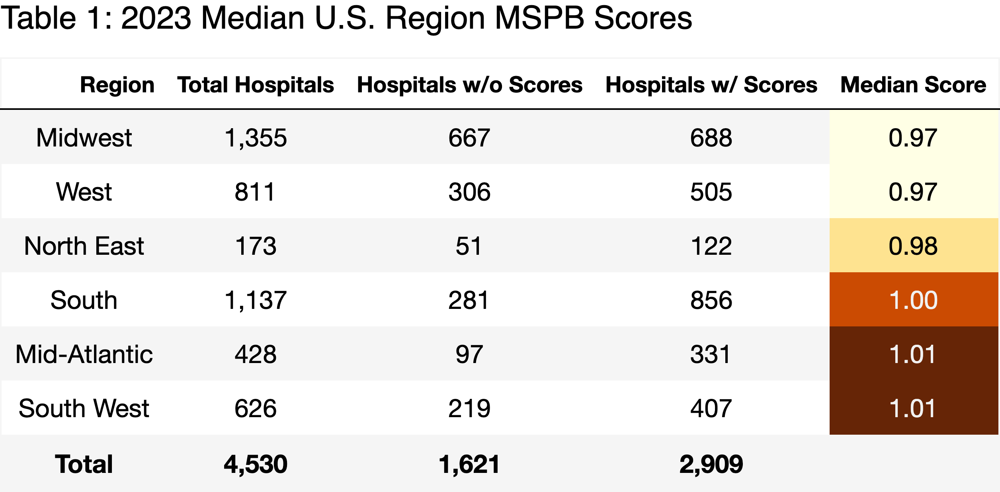

# 2023-Hospital-Medicare-Spending-per-Beneficary-Score-MSPB-Analysis
The purpose of this analysis is to produce a sample output of a one-page summary report using 2023 MSBP score data from U.S.-based hospitals.  

## Description

The following steps were conducted within this analysis: 

## Getting Started

### Dependencies
To download the most up-to-date Medicaid data, go to: https://data.cms.gov/provider-data/dataset/rrqw-56er#data-table
or use the "Medicare_Hospital_Spending_Per_Patient-Hospital.csv" included in this repository (downloaded 10/2/2025).

Use "2023MSPBAnalysis.py" to see data cleaning and visualizations code.

Relevant packages: 
import numpy as np
import matplotlib.colors as mcolors
import geopandas as gpd 
from shapely.geometry import Polygon
import os
from fpdf import FPDF
import time
import pandas as pd
import matplotlib.pyplot as plt
import dataframe_image as dfi 

### Installing

Modify file path names for uploading the Medicaid dataset and output files. 
Install geopandas and dataframe_image in your terminal using: 

pip install geopandas
pip install dataframe_image

## Useful Resources
https://david-kyn.medium.com/workplace-automation-generate-pdf-reports-using-python-fa75c50e7715

https://medium.com/@alex_44314/use-python-geopandas-to-make-a-us-map-with-alaska-and-hawaii-39a9f5c222c6

https://pandas.pydata.org/docs/user_guide/style.html

## Author
Emily Quick-Cole

## Ouptuts
[Medicare_report.pdf](https://github.com/user-attachments/files/22932931/Medicare_report.pdf)
<object data="2023MSPBReport.pdf" width="1000" height="1000" type='application/pdf'/>

## Figures

